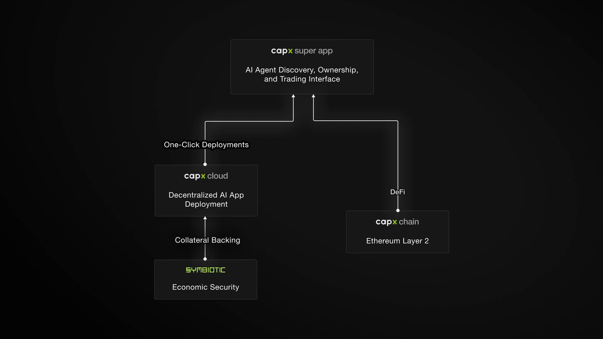
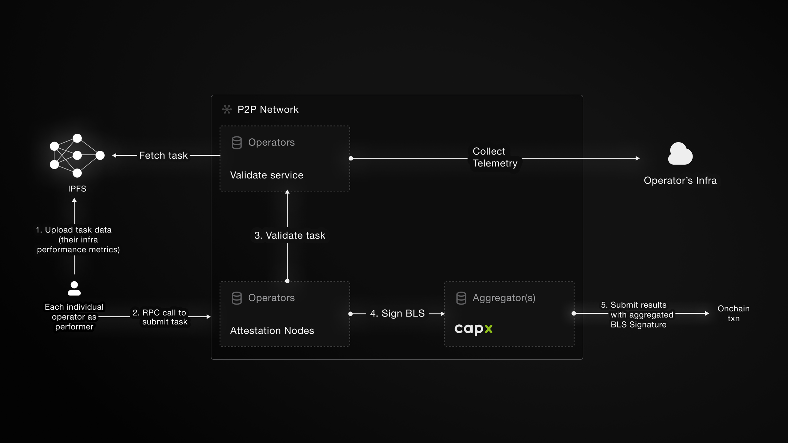
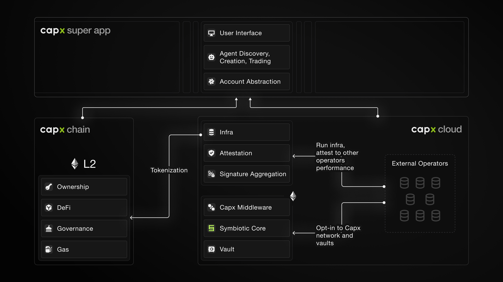

# Introduction

## What is Capx Cloud?

Capx Cloud is a groundbreaking, decentralized cloud computing platform specifically designed to power the next generation of Artificial Intelligence (AI) workloads. It leverages the power of blockchain technology to create a secure, scalable, and cost-effective environment for deploying and utilizing AI agents. 

At its core, Capx Cloud comprises three primary components:

1. **Capx Chain:** An innovative Ethereum Layer 2 solution that provides a high-throughput, low-fee environment for on-chain transactions and interactions within the Capx ecosystem.
2. **Capx SuperApp:** A user-friendly, intuitive interface that makes interacting with decentralized AI as simple as using a traditional web application. It allows users to easily discover, own, and trade AI agents.
3. **Capx Cloud:** The decentralized compute layer that enables the deployment and execution of AI agents. It utilizes a network of independent operators who contribute resources (CPU, memory, GPU) and are rewarded for their participation.

These components are seamlessly integrated and powered by the native **\$CAPX** token, which serves as the lifeblood of the Capx ecosystem, facilitating transactions, governance, and incentivizing participation.

## Why Capx Cloud?

Capx Cloud offers a compelling alternative to traditional, centralized cloud providers for AI workloads. Here's why you should consider it:

*   **Cost-Effectiveness:** By utilizing a decentralized network of operators, Capx Cloud significantly reduces the cost of deploying and running AI agents compared to traditional cloud services.
*   **Scalability:** The decentralized nature of Capx Cloud allows it to scale dynamically to meet the growing demands of AI applications without the limitations of centralized infrastructure.
*   **Security:** Capx Cloud leverages the cutting-edge restaking mechanism provided by **Symbiotic**, ensuring the security and integrity of the network through economic incentives and slashing mechanisms. This robust security model safeguards against malicious actors and ensures reliable operation.
*   **User-Friendly Experience:** The Capx SuperApp provides a seamless and intuitive user experience, abstracting away the complexities of blockchain technology and making it accessible to a wider audience.
*   **Decentralization:** Capx Cloud empowers a community-driven ecosystem where users and operators collectively govern the platform, fostering transparency and innovation.
*   **AI Agent Ownership and Trading:** Capx Cloud introduces a new paradigm for AI, allowing users to truly own and trade AI agents as digital assets, fostering a vibrant marketplace for AI innovation.

## Target Audience

This documentation is intended for a diverse audience, including:

*   **End-Users:** Individuals interested in exploring, using, and trading AI agents on the Capx SuperApp.
*   **Developers:** Software engineers and AI researchers looking to develop and deploy AI agents on a decentralized, cost-effective, and scalable platform.
*   **Operators:** Individuals or organizations interested in contributing compute resources to the Capx Cloud network and earning rewards for their participation.

# **Capx Cloud**

Capx Cloud forms the core of the decentralized compute layer, enabling the deployment and execution of AI agents in a secure, efficient, and scalable manner. It represents a paradigm shift from traditional cloud computing by leveraging a network of independent operators instead of relying on centralized infrastructure.

## **Vision and Goals**

Capx Cloud is driven by a vision to democratize access to AI by creating a decentralized, open, and accessible platform for AI development and deployment. Its primary goals include:

*   **Decentralization:** To distribute control and ownership of AI infrastructure across a network of participants, eliminating single points of failure and censorship.
*   **Scalability:** To provide a highly scalable infrastructure that can adapt to the ever-increasing demands of AI workloads.
*   **Cost-Effectiveness:** To significantly reduce the cost of AI computation by leveraging a competitive marketplace of resource providers.
*   **Security:** To ensure the security and integrity of AI operations through robust mechanisms like restaking and attestation.
*   **Accessibility:** To make AI development and deployment accessible to a wider audience through user-friendly tools and interfaces.
*   **Interoperability:** To facilitate seamless integration with other blockchain networks and protocols, fostering a collaborative AI ecosystem.

## **Foundational Concepts**

Understanding the following concepts is crucial to grasping how Capx Cloud operates:

*   **Decentralized AI Deployment:** Unlike traditional cloud platforms where AI models are deployed on centralized servers, Capx Cloud distributes AI agent deployment across a network of independent operators.
*   **Operators:** Individuals or organizations that contribute compute resources (CPU, memory, GPU) to the Capx Cloud network. They are incentivized to provide reliable and secure services through rewards in $CAPX tokens.
*   **Restaking:** A security mechanism, powered by Symbiotic, that involves operators staking collateral to guarantee their honest behavior. This collateral can be slashed if an operator acts maliciously, ensuring the integrity of the network.
*   **Attestation and Aggregation:** A process that verifies the performance and availability of operators. Operators are required to provide attestations of their work, which are then aggregated and validated to ensure they are meeting the network's requirements.

## **Symbiotic Protocol**

Capx Cloud integrates with the Symbiotic protocol to leverage its restaking capabilities. Symbiotic provides a secure and efficient framework for operators to stake collateral and participate in the network's security. This integration is crucial for:

*   **Enhanced Security:** Symbiotic's restaking model provides a strong economic guarantee of operator honesty, as any malicious behavior results in the slashing of their staked collateral.
*   **Incentive Alignment:** Operators are incentivized to provide reliable and secure services to avoid losing their stake, aligning their interests with the overall health of the network.
*   **Dynamic Security:** The restaking mechanism allows for dynamic adjustments to the security level based on the amount of collateral staked, ensuring that the network remains secure as it scales.

## **Capx Cloud Architecture**

The architecture of Capx Cloud is designed to facilitate the seamless deployment, execution, and management of AI agents. Here's a breakdown:

1. **Agent Deployment:** Developers deploy AI agents to the Capx Cloud network through the Capx SuperApp or directly via smart contracts on the Capx Chain.
2. **Resource Allocation:** The Capx Cloud protocol matches AI agent resource requirements with available operator resources.
3. **Operator Execution:** Operators execute AI agent workloads on their infrastructure, providing attestations of their work.
4. **Attestation and Aggregation:** Attestations are aggregated and validated to ensure operator performance and availability.
5. **Reward Distribution:** Operators receive rewards in $CAPX tokens based on their contributions and performance.
6. **Restaking Integration:** Symbiotic manages the staking and slashing of operator collateral, ensuring network security.
7. **Governance:** $CAPX token holders participate in the governance of the Capx Cloud protocol, influencing its development and operation.

This architecture enables a decentralized, secure, and efficient environment for AI workloads, fostering a collaborative and innovative AI ecosystem.

## Capx Cloud System 

This section delves deeper into the Capx Cloud system architecture, outlining the crucial actors and their interactions within the infrastructure.

**Key Actors**

The Capx Cloud ecosystem is built around these key actors:

1. **Users:**
    *   **Agent Users:** These users interact with AI agents through the Capx SuperApp. They are the primary consumers of the AI services provided on the platform.
    *   **Token Holders:** These users hold and utilize $CAPX tokens, participating in the economic and governance aspects of the Capx ecosystem.
2. **Developers:**
    *   **Agent Developers:** These developers are responsible for creating and deploying the AI agents that power the Capx Cloud.
    *   **Application Developers:** They build applications that leverage the Capx SuperApp and integrate with the deployed AI agents.
3. **Operators:**
    *   **Compute Provider:** Operators contribute essential computing resources, such as CPU, memory, and GPU, to the network. They are responsible for executing the AI agent workloads.
    *   **Restaker:** Operators also function as restakers, staking collateral through the Symbiotic protocol to ensure the security and trustworthiness of the network.
4. **Capx SuperApp:** The SuperApp acts as the central interface for users to interact with the Capx Cloud. It simplifies the user experience, making it easy to discover and use AI agents.
5. **Capx Chain:** This is the foundational blockchain infrastructure that enables secure and transparent transactions within the Capx ecosystem. It handles key operations like agent deployment, resource allocation, and reward distribution.
6. **Symbiotic:** Symbiotic is the restaking protocol integrated into Capx Cloud. It plays a critical role in maintaining network security by managing the staking and potential slashing of operator collateral.

**Interactions**

*   **User-SuperApp Interaction:** Users interact with the Capx SuperApp to access and utilize AI agents.
*   **Developer-SuperApp/Chain Interaction:** Developers use the SuperApp or interact directly with the Capx Chain to deploy their AI agents.
*   **Operator-Network Interaction:** Operators provide compute resources to the network and execute AI agent workloads.
*   **Operator-Symbiotic Interaction:** Operators engage with Symbiotic for restaking purposes, contributing to network security.
*   **SuperApp-Chain Interaction:** The Capx SuperApp interacts with the Capx Chain to facilitate various operations, including agent discovery and resource allocation.
*   **Chain-Ecosystem Interaction:** The Capx Chain serves as the backbone for all on-chain transactions and interactions within the Capx ecosystem.

## **Technological Foundation: Capx Chain and Symbiotic Integration**

This subsection dives into the underlying technological framework that powers Capx Cloud, focusing on the Capx Chain and its integration with the Symbiotic protocol.

### **Capx Chain (Layer 2 on Ethereum)**

Capx Chain serves as the foundational blockchain infrastructure for the Capx Cloud ecosystem. Built as an Ethereum Layer 2 solution using the **Arbitrum Nitro** stack, it offers several key advantages:

*   **Scalability and Efficiency:** Leveraging Arbitrum Nitro's capabilities, Capx Chain provides high throughput and low transaction fees. This ensures seamless deployments of AI agents and enables frequent verifications across various operations, including agent tokenization, smart wallet implementations, and trading activities.
*   **Smart Contract Functionality:** Capx Chain supports robust smart contract functionality, enabling the tracking of operator reputations, slashing events, token distributions, and DAO-style governance. This ensures transparency and accountability within the ecosystem.
*   **Custom Gas Fee Optimizations:** The platform incorporates custom gas fee optimizations to further reduce transaction costs, making it more economical for users and developers to interact with the Capx Cloud.

### **Symbiotic Integration: A Foundation for Trust and Security**

Capx Cloud leverages the **Symbiotic** protocol's (re)staking framework to create a secure and economically aligned ecosystem. This integration is crucial for establishing trust and incentivizing proper behavior among network participants.

*   **Vaults as Economic Hubs:** Symbiotic utilizes specialized smart contracts called **vaults** to manage staked assets. These vaults enforce specific parameters, such as epoch duration, maximum deposit limits, and delegation models. Stakers deposit assets into vaults, which are then delegated to operators and networks.
*   **Determining Economic Weight:** The amount of stake delegated to an operator through these vaults determines their **economic weight** within the network. This weight signifies the operator's credibility and the financial risk they bear, encouraging reliable and honest behavior. Operators with higher stakes are considered more valuable but also face greater penalties for misconduct.
*   **Operators as Infrastructure Providers:** Operators form the backbone of Capx Cloud's decentralized compute layer. They are vetted entities who opt into specific vaults and networks to provide their services. Their performance is continuously tracked, with exceptional operators receiving better task allocations and rewards.
*   **Resolvers for Fair Arbitration:** In cases of disputed slashing conditions, **resolvers** act as neutral arbiters. They review evidence and can either confirm or veto slashing requests, ensuring fairness and preventing unwarranted asset seizure. This reinforces trust in the system and encourages adherence to protocol rules.

The integration of vaults, operators, and resolvers through Symbiotic provides Capx Cloud with a flexible and adaptable foundation for trust-minimized infrastructure. This combination balances economic incentives, technical reliability, and fair adjudication, ensuring the system's stability and preventing any single entity from undermining it.

## **Roles and Responsibilities within the Capx Cloud Ecosystem**

Capx Cloud is designed as an interconnected ecosystem where each role—Performer Nodes, Attestor Nodes, Operators, Delegators, and Resolvers—collaborates to provide reliable, secure, and efficient decentralized services. These roles are interdependent, with each participant contributing unique expertise to maintain network integrity and scalability.

### **Performer Node**

Performer Nodes are the engine of the Capx Cloud network, responsible for executing the core AI computations and tasks submitted by users. These nodes form the foundation of the decentralized infrastructure, ensuring tasks are processed efficiently, reliably, and at scale. Their role is vital for supporting AI-driven applications and other AI-based operations.

When a user submits a task—such as running an AI model, processing data, or performing complex calculations—the Performer Node undertakes the execution.

**Key Responsibilities:**

*   **Task Execution:** Upon receiving a task, the Performer Node utilizes its computational resources to process and complete the task efficiently.
*   **Proof of Task Generation:** After completing the task, the node generates a cryptographic proof, known as the Proof of Task, which serves as verifiable evidence of the task's execution.
*   **Result Dissemination:** The Performer Node then broadcasts the task results and the Proof of Task to the network, ensuring transparency and enabling subsequent validation.

**Importance in the Network:**

The efficiency and reliability of Performer Nodes are crucial, as they directly impact the network's ability to handle complex computations and deliver timely results to users. Performer Nodes regularly communicate with other components in the Capx Cloud, particularly Attestor Nodes, to ensure the integrity of their output. This continuous verification cycle establishes trust and minimizes the risk of fraudulent or incorrect task execution.

### **Attestor Node**

Attestor Nodes serve as the Capx Cloud’s quality assurance mechanism, validating tasks executed by Performer Nodes. Their primary objective is to ensure that all computations meet the network’s predefined standards for accuracy and reliability. This process strengthens trust and prevents tampering or dishonesty within the network.

**Key Responsibilities:**

*   **Validation Process:** Upon receiving the Proof of Task and associated results from a Performer Node, Attestor Nodes independently verify the accuracy and legitimacy of the execution.
*   **Consensus Mechanism:** Attestor Nodes participate in a consensus protocol, where they cast votes on the validity of each task. A task is approved if a supermajority (typically two-thirds) of Attestor Nodes confirm its validity.
*   **Enforcement of Penalties:** If a significant portion of Attestor Nodes (e.g., more than one-third) deems a task invalid, the network enforces penalties, such as slashing, against the responsible Performer Node to uphold network integrity.

**Importance in the Network:**

By validating tasks, Attestor Nodes ensure that only accurate and trustworthy computations are accepted, preventing fraudulent or erroneous outputs. Their role is essential for maintaining the network's credibility and ensuring that users can trust the results produced by the Capx Cloud.

### **Operator**

Operators are the custodians of the Capx Cloud network, managing the infrastructure that keeps everything running smoothly Their responsibilities extend across multiple layers of the network, ensuring the stability, scalability, and security of decentralized services. Operators play a crucial role in maintaining node uptime, managing upgrades, and safeguarding the infrastructure against threats.

**Operators who have opted-in into the Capx Cloud Network**

*   P2P
*   Luganodes
*   Kiln
*   PierTwo
*   Alchemy
*   Node Monster
*   Certik
*   Block & Bones
*   and many more..

**Key Responsibilities:**

*   **Infrastructure Management:** Operators oversee the setup, configuration, and maintenance of nodes, ensuring optimal performance and minimal downtime.
*   **Security Enforcement:** They implement security protocols to protect nodes from threats and ensure data integrity.
*   **Governance Participation:** Operators engage in the network's governance processes, contributing to decision-making on protocol upgrades, policy changes, and other critical matters.

Through the Symbiotic protocol, operators can accept stakes from diverse partners via unified vaults. This system enables operators to run a single infrastructure for multiple stakeholders without the complexity of separate setups. By doing so, operators improve resource efficiency while broadening access to network services for stakers and users alike.

### **Delegator**

Delegators are crucial contributors to the Capx Cloud’s security and stability. Rather than directly operating nodes, they delegate their staked assets to trusted operators, thereby supporting network infrastructure while earning rewards for their participation. Delegators play a vital role in decentralizing the network by distributing stake among various operators.

**Key Responsibilities:**

*   **Operator Selection:** Delegators carefully choose reputable Operators based on performance metrics, reliability, and trustworthiness.
*   **Stake Delegation:** They allocate their assets to selected Operators, thereby enhancing the Operators' capacity to manage more tasks and secure the network.
*   **Governance Participation:** Delegators engage in voting processes, influencing decisions on network policies, upgrades, and other governance matters.

**Importance in the Network:**

Delegation lowers the barrier to entry for those who wish to support decentralized infrastructure without managing technical operations. Through their contributions, Delegators enhance the network’s economic security, allowing it to scale while maintaining decentralization and resilience.

### **Resolvers**

Resolvers are specialized entities responsible for resolving disputes within the Capx Cloud network. They serve as arbiters, handling disputes and overseeing slashing incidents—penalties imposed for malicious or faulty behavior when a Performer Node fails to meet task execution standards. Resolvers provide an impartial mechanism for reviewing these incidents to ensure that penalties are applied fairly and in accordance with network policies.

**Key Responsibilities:**

*   **Dispute Resolution:** Resolvers review conflicts arising from task executions, validations, or other network activities, providing impartial judgments.
*   **Slashing Oversight:** They assess slashing incidents to confirm that penalties are warranted and executed fairly.
*   **Policy Enforcement:** Resolvers ensure that all actions taken within the network adhere to established rules and guidelines, maintaining fairness and transparency.

Resolvers operate under predefined agreements between networks and vaults. Depending on the network’s risk tolerance, multiple resolvers may collaborate to reach a consensus before approving or vetoing a slashing event. This arrangement provides additional security guarantees for stakeholders, as decisions are made transparently and through a decentralized process.

**Importance in the Network:**

By providing a structured mechanism for dispute resolution and penalty enforcement, Resolvers uphold the network. Allowing for flexible, scalable governance structures tailored to the needs of different protocols within the Capx Cloud ecosystem.

## Getting Started

As of today, AI agent deployment on Capx Cloud is still under Mainnet-Beta, and therefore permissioned. With around 15 AI Agent Apps LIVE on Capx Cloud, if you wish to leverage Capx Cloud to test and deploy your AI Agent on our infrastructure kindly get in touch with the team by filling the following form. 

[Google Form](https://capx.ai)